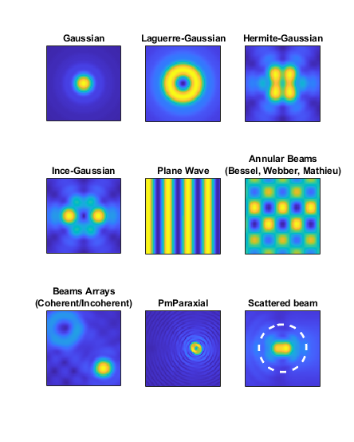

.. automodule:: +ott.+beam

.. _beam-package:

##############
`beam` Package
##############

The `beam` package provides classes representing optical tweezers toolbox
beams.  The base class for beams is :class:`Beam`.  Sub-classes provide
beam specialisations for specific beam types (such as :class:`Gaussian`,
:class:`PlaneWave`, :class:`Webber`), point matching for modelling the
fields at the back aperture of a objective (:class:`PmParaxial`),
arrays of beams (:class:`Coherent`, :class:`Incoherent`), and
:class:`Scattered` beams.  A summary is presented in
:numref:`package-overview-beam`.

Unlike :class:`+ott.+bsc.Bsc` instances, :class:`Beam` instances
use SI units (i.e., force in Newtons, distance in meters).

Internally, the :class:`Beam` classes use :class:`+ott.+bsc.Bsc` to represent
the fields.  Most class properties are defined in separate classes (declared
in the :mod:`+properties` sub-package.
In a future release of OTT, the :class:`Beam` interface may
change to support other types of field representations.

.. _package-overview-beam:

   Graphical display of the different kinds of beams currently included
   in the optical tweezers toolbox.

.. contents:: Contents
   :depth: 3
   :local:
..

Base Classes
============

Beam
----

.. autoclass:: Beam

BscBeam
-------

.. autoclass:: BscBeam

BscFinite
---------

.. autoclass:: BscFinite

BscInfinite
-----------

.. autoclass:: BscInfinite

Scattered
=========

.. autoclass:: Scattered

Beam types
==========

Gaussian
--------

.. autoclass:: Gaussian

LaguerreGaussian
----------------

.. autoclass:: LaguerreGaussian

HermiteGaussian
---------------

.. autoclass:: HermiteGaussian

InceGaussian
------------

.. autoclass:: InceGaussian

PlaneWave
---------

.. autoclass:: PlaneWave

Mathieu
-------

.. autoclass:: Mathieu

Webber
------

.. autoclass:: Webber

Bessel
------

.. autoclass:: Bessel

Annular
-------

.. autoclass:: Annular

PmParaxial
----------

.. autoclass:: PmParaxial

Array types
===========

Coherent
--------

.. autoclass:: Coherent

Incoherent
----------

.. autoclass:: Incoherent

