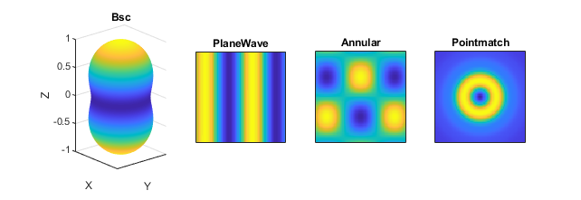

.. automodule:: +ott.+bsc

.. _bsc_package:

#############
`bsc` Package
#############

The `bsc` package provides classes for representing beams in a vector
spherical wave function (VSWF) basis.  The base class for all VSWF beams is
:class:`Bsc`, which provides methods for visualising beams, calculating
forces, and manipulating the VSWF data.
Similar to T-matrices, the data is stored internally as a vector, allowing
the type to be changed to any valid Matlab matrix type (such as
``gpuArray`` or ``sparse``).

Simple multipole beams can be created by directly specifying their beam
shape coefficients.  For more complex beams, the :class:`Pointmatch`,
:class:`PlaneWave` and :class:`Annular` classes provide provide methods
to calculate BSC data.  Additionally, the :class:`PlaneWave` and
:class:`Annular` beams provide alternative translation methods that are
more optimal for these types of beams.
These methods are summarised in :numref:`package-overview-bsc`.

Unlike the previous version of the toolbox, the `Bsc` class does not track
the position/rotation of the beam.  This is to avoid suggesting that the
beam actually has a well defined position/rotation.
Other notable differences include the use of Hetrogeneous arrays,
support for arbitrary beam data data-types, and moving user friendly
features such as nice units to :class:`+ott.+beam.Beam`.

`Bsc` rotations have units of radians and displacements have units of
medium wavelength.  For a more user friendly interface with SI units,
see :class:`+ott.+beam.Beam`.

.. _package-overview-bsc:

   Graphical display showing the different BSC classes currently included
   in the T-matrix.  The Bsc class is the base class and can be used directly
   for simple multipole mode descriptions.  The other classes provide
   specialisations and methods for approximating more complex beams.

.. contents:: Contents
   :depth: 3
   :local:
..

Bsc
===

.. autoclass:: Bsc

Pointmatch
==========

.. autoclass:: Pointmatch

PlaneWave
=========

.. autoclass:: PlaneWave

Annular
=======

.. autoclass:: Annular

