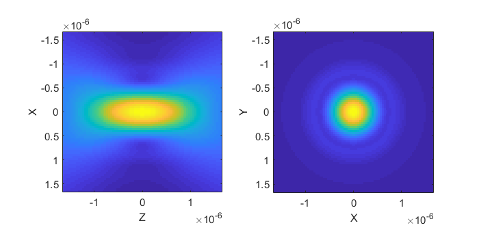
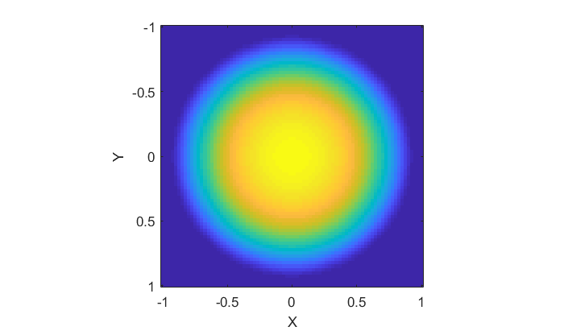
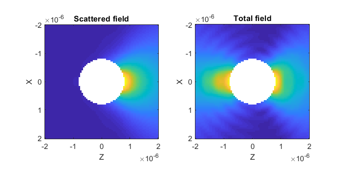
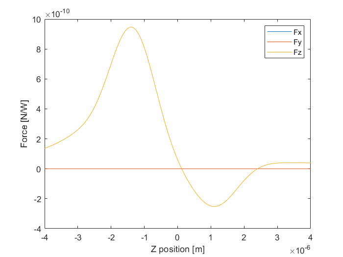

.. _calculating-forces-on-a-spherical-particle:

##########################################
Calculating forces on a spherical particle
##########################################

This section is a companion for the ``examples/example_sphere.m`` script
and will guide you through the core functionality of the toolbox.
The script sets up the variables for calculating forces on a spherical
particle in a Gaussian beam.  The particle is created using the
:meth:`+ott.Tmatrix.simple` method, which for a spherical particle
calls the :class:`+ott.TmatrixMie` class constructor.
The beam is constructed using the :class:`+ott.BscPmGauss` class which
can also be used for Laguerre-Gaussian and Hermite-Gaussian beam modes.
And, forces are calculated using :func:`+ott.forcetorque`.
A similar example is described in :ref:`calculating-forces-with-the-gui`.

.. contents:: Contents
   :depth: 3
   :local:
..

Setting up the Matlab workspace
===============================

The ``example_sphere.m`` script starts by setting up the Matlab workspace
to work with OTT.
The first step is to add OTT to the Matlab path, this step is not required
if OTT is already on the path (for instance, if you installed OTT via the
add-ons menu, OTT should already be on the path).

.. code:: matlab

   addpath('../');   % Change this to your OTT path if required

The next step is clearing all existing variables and configuring OTT
specific warnings.  Some OTT functions can trigger many warnings, to
reduce the verbosity of the output, OTT can be asked to only warn once
about issues during this Matlab session.
Several OTT functions are also likely to move in a future release, we
can turn off warnings related to these changes here too.

.. code:: matlab

   close all;
   ott.warning('once');
   ott.change_warnings('off');

Next, we declare our material properties, wavelength, sphere radius and
numerical aperture for the objective.

.. code:: matlab

   n_medium = 1.33;        % Water
   n_particle = 1.59;      % Polystyrene
   wavelength0 = 1064e-9;  % Vacuum wavelength
   wavelength_medium = wavelength0 / n_medium;
   radius = 1.0*wavelength_medium;
   NA = 1.02;              % Numerical aperture of beam

Generating the beam shape coefficients
======================================

To create a beam, we use :class:`+ott.BscPmGauss`.
The constructor for this class accepts several positional and named
arguments, in this example we set the numerical aperture, polarisation,
refractive index and vacuum wavelength.

.. code:: matlab

   beam = ott.BscPmGauss('NA', NA, 'polarisation', [ 1 1i ], ...
        'index_medium', n_medium, 'wavelength0', wavelength0);

The class can also be used for generating Laguerre-Gaussian beams and
other type of beams by adding additional parameters.  For example,
the following would generate an LG(0, 3) beam

.. code:: matlab

   beam = ott.BscPmGauss('lg', [ 0 3 ], ...
        'polarisation', [ 1 1i ], 'NA', NA, ...
        'index_medium', n_medium, 'wavelength0', wavelength0);

We may also want to set or normalise the beam power, this can be done at
any time by setting the ``power`` property, for example

.. code:: matlab

   beam.power = 1.0;

Regardless of the type of beam we are using, we are now able to visualise
the beam.  The :class:`+ott.Bsc` base class (which :class:`+ott.BscPmGauss`
inherits from) defines several visualisation function.
To visualise the field around the focus, we can use
:meth:`+ott.Bsc.visualise`.  Before calling the function we need to
specify the vector spherical wave function basis to use, for near-field
visualisation this should be set to `regular`.

.. code:: matlab

   beam.basis = 'regular';

   figure();
   subplot(1, 2, 1);
   beam.visualise('axis', 'y');
   subplot(1, 2, 2);
   beam.visualise('axis', 'z');

The above code should produce something similar to figure
:numref:`example-sphere-nearfield`.
The `axis` parameter specifies which axis should be normal to our
visualisation slice.

.. _example-sphere-nearfield:

   Visualisation of the incident beam near-field.

We can also visualise the far-field of the beam.
For this we set the basis to `incoming` and use the
:meth:`+ott.Bsc.visualiseFarfield` function.

.. code:: matlab

   beam.basis = 'incoming';

   figure();
   beam.visualiseFarfield('dir', 'neg');

The above should produce something similar to figure
:numref:`example-sphere-farfield`.
The `dir` parameter specifies which hemisphere we want to look at,
in this case we look at the negative (backward) hemisphere.
Depending on the beam and the chosen basis, either the forward or backward
hemisphere may have very little power, if you are unsure about the
direction of your beam it is a good idea to look in both directions.

.. _example-sphere-farfield:

   Visualisation of the incident beam far-field.

Generating the T-matrix
=======================

In this simulation we use a T-matrix for a spherical particle.
The T-matrix is diagonal and the elements along the diagonal are
the Mie coefficients for a sphere.
To calculate the T-matrix we use the :meth:`+ott.Tmatrix.simple`
method, we specify the shape as a sphere and the method automatically
selects the best method for this shape, in this case
:class:`+ott.TmatrixMie`.
The :meth:`+ott.Tmatrix.simple` method takes various named parameters
for the particle size, shape and refractive index.

.. code:: matlab

   T = ott.Tmatrix.simple('sphere', radius, 'wavelength0', wavelength0, ...
      'index_medium', n_medium, 'index_particle', n_particle);

For a sphere, this should only take a couple of seconds to evaluate.

Calculate the scattered field
=============================

The T-matrix and beam objects encapsulate the data for the T-matrix
and beam shape coefficients (a matrix and vector respectively).
We can view this data by accessing the ``data`` attribute of these objects,
for example

.. code:: matlab

   disp(T.data);

In the T-matrix method, a T-matrix describes how a particle scatters
light.  It is a linear matrix which relates each incident mode to
each scattered mode, mathematically this is

.. math::

   \left(\begin{array}{l}p \\ q\end{array}\right) =
      T \left(\begin{array}{l}a \\ b\end{array}\right)

where :math:`T` is the T-matrix, and :math:`(a,b)`,
:math:`(p, q)` are the incident and scattered beam shape coefficients.
To implement this in OTT, we can simply write

.. code:: matlab

   sbeam = T * beam;

This is equivalent to directly multiplying the
``T.data`` and ``beam.data`` matrix and vector objects to calculate
the resulting scattered beam shape coefficients, and encapsulating
the result in a :class:`+ott.Bsc` object.

As with the incident beam, we are able to generate various visualisations
of the fields.
The following example shows a visualisation of the scattered field
and the total field (incident + scattered) around the beam focus,
for the sphere and Gaussian beam described above, the results are
shown in :numref:`example-sphere-total-scattered`.

.. code:: matlab

   figure();
   subplot(1, 2, 1);
   sbeam.basis = 'outgoing';
   sbeam.visualise('axis', 'y', ...
      'mask', @(xyz) vecnorm(xyz) < radius, 'range', [1,1]*2e-6)
   title('Scattered field');

   subplot(1, 2, 2);
   tbeam = sbeam.totalField(beam);
   tbeam.basis = 'regular';
   tbeam.visualise('axis', 'y', ...
      'mask', @(xyz) vecnorm(xyz) < radius, 'range', [1,1]*2e-6)
   title('Total field');

.. _example-sphere-total-scattered:

   The total and scattered field visualised for a spherical particle
   at the focus of a Gaussian beam.
   This slice is along the beam axis, the region corresponding to
   the particle has been removed.

The T-matrix in this example only gives the fields outside the particle,
we use the ``mask`` parameter to remove the region inside the particle.
To visualise the fields inside the particle we would need to calculate
a internal T-matrix instead.

Calculating optical forces
==========================

Now that we have a scattered beam, we are able to calculate the change
in momentum between the incident beam and the particle; and, therefore,
infer the force acting on the particle.
The main function for calculating forces is :func:`+ott.forcetorque`,
this function can operate on beams or beams and T-matrix.
When both the inputs are beams, the function calculates forces and
torques using various summations over the beam shape coefficients.

.. code:: matlab

   [force, torque] = ott.forcetorque(beam, sbeam);

In this example, the force would be ``0.0135`` and the torque would be
``1e-16`` which is on the order of round-off error (i.e. numerically
equivalent to zero).
The units depend on the units used for the beam, in this example we
can convert to SI units (Newtons) using

.. code:: matlab

   nPc = 0.001 .* index_medium / 3e8;  % 0.001 W * n / vacuum_speed
   force_SI = force .* nPc

Beam translations
=================

Being able to calculate optical forces is only useful if we can
translate either the beam or the particle to different locations.
For this, we can use the beam :meth:`+ott.Bsc.translateXyz` function.
The behaviour of this function depends on the current beam basis:
if the beam was generated using one of the ``ott.Bsc*`` functions,
the basis should typically be set to `regular`; if the beam was generated
from scattering by another particle, the basis should be `outgoing`.
For example, in this example we could translate the beam along the
`x`-axis with

.. code:: matlab

   beam.basis = 'regular';
   x = 1.0e-6; y = 0.0e-6; z = 0.0e-6;
   offset_beam = beam.translateXyz([x; y; z]);

We could translate the beam and calculate the forces multiple times
with the above method; however, OTT provides a more convinient method
using :func:`+ott.forcetorque`.

Calculate multiple forces with ``ott.forcetorque``
==================================================

Instead of passing two beam objects to :func:`+ott.forcetorque`, we could
instead pass a beam and T-matrix object and the various positions
we want to translate the beam to.
As with other translations, it is important to set the basis of the
incident beam before calling the method.
The following code calculates the force along the beam axis (the
`z`-axis), output is shown in :numref:`example-sphere-force`.

.. code:: matlab

   xyz = [0;0;1] .* linspace(-4, 4, 100).*1e-6;
   fxyz = ott.forcetorque(beam, T, 'position', xyz);

   figure();
   nPc = n_medium / 3e8;  % n / vacuum_speed
   plot(xyz(3, :), fxyz .* nPc);
   xlabel('Z position [m]');
   ylabel('Force [N/W]');
   legend({'Fx', 'Fy', 'Fz'});

.. _example-sphere-force:

   The force on a spherical particle positioned at different locations
   along the beam axis.  The transverse components of the force are
   approximately zero.  The axial force displays the well known
   profile of an optically traped particle.

