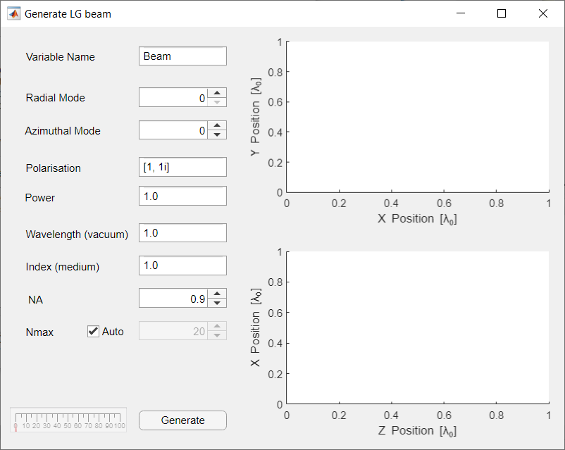
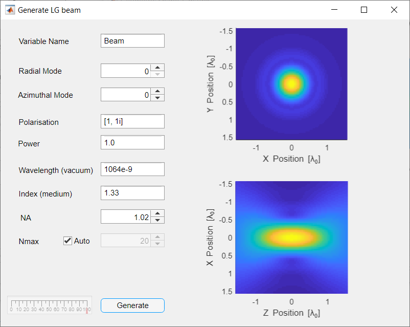
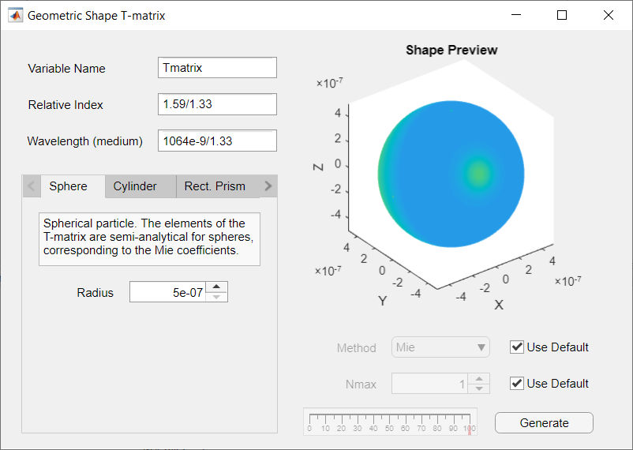
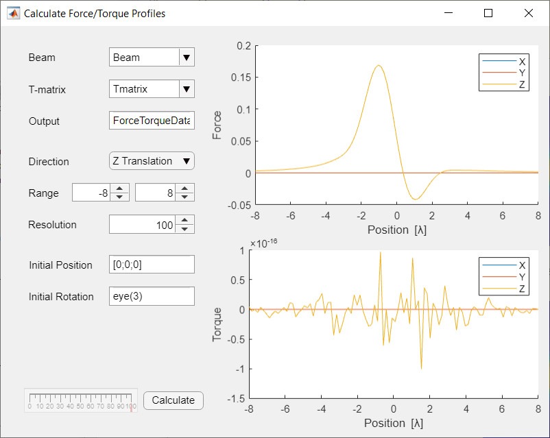

.. _calculating-forces-with-the-gui:

###############################
Calculating forces with the GUI
###############################

In this example we calculate the forces on a spherical particle for
different axial and radial displacements in a Gaussian beam.
We use the GUI for calculating the forces, generating the beam shape
coefficients for the beam and calculating the T-matrix for the particle.
This example produces similar output to the spherical particle example
script (``examples/example_sphere.m``) without needing to write a
single line of Matlab code.

Before starting this example, ensure you have OTT installed and are
able to launch the Launcher GUI, see :ref:`getting-started` for details.

In this example, we generate the beam shape coefficients for a Gaussian
beam, calculate the T-matrix for a spherical particle and 

.. contents:: Contents
   :depth: 3
   :local:
..

Generating a Gaussian beam
--------------------------

To generate a LG beam, we will use `LG beam` application, which
uses :class:`+ott.BscPmGauss` to generate Gaussian and LG beams.
Open the Launcher and select **BSC** > **LG beam** > **Launch** to
open the `LG beam` application.
The window shown in :numref:`gui-example-generate-lg-beam` should display.

.. _gui-example-generate-lg-beam:

   The Generate LG Beam GUI with all the default parameters.

For a Gaussian beam, we want to set the radial and azimuthal modes to 0
(the default).  For this example we will use a circularly polarised beam,
so we set the polarisation to ``[1, 1i]`` (the default).
For the vacuum wavelength we will enter ``1064.0e-9``, corresponding to
1064nm, and we will use the refractive index of water for the medium
(enter ``1.33`` into the *Index (medium)* field).
Finally, for the NA we will use ``1.02``.

For most Gaussian and LG beam we do not need to explicitly set
:math:`N_{max}`.
A general rule of thumb is Nmax should be large enough to surround the
beam focus, so most of the beam power goes through a circle of radius
:math:`N_{max}k_{medium}` where :math:`k_{medium}` is the wavenumber
in the medium.

Once all the parameters have been set, click **Generate**.
Depending on you computer this may take a couple of seconds or a few
minutes.
The resulting output is shown in figure :numref:`gui-example-beam-output`.
Additionally, a variable should be created in the Matlab workspace
for our new beam (we will use this variable later).

.. _gui-example-beam-output:

   The Generate LG Beam GUI after clicking the Generate button should
   now display the beam transverse and axial field distributions.

Generating the T-matrix
-----------------------

To generate the T-matrix representing the scattering by a spherical
particle we can use the `Geometric shape` GUI.
This GUI attempts to use the appropriate T-matrix method for the
given geometric shape.
To launch the GUI, open the launcher and select
**T-matrix** > **Geometric shape** > **Launch**.

For this example, we want to simulate a spherical polystyrene
particle with refractive index 1.59.
For the relative refractive index field we enter ``1.59/1.33``, this
expression is evaluated in the Matlab workspace and should produce
about 1.2.
It is also possible to enter a variable name, for instance, if we had
a variable called ``index_medium`` we could have written
``1.59/index_medium``.
For the wavelength we enter ``1064.0e-9/1.33``.
Make sure the sphere option is selected and set the radius to
500 nm (i.e., `5e-7`).
For a spherical particle, we leave the Nmax and Method options
with their default values.

Finally click Generate.
The progress bar should change and a T-matrix object should be added to
the Matlab workspace.
For spherical particles this shouldn't take very long, however for other
shapes this could take hours depending on the shape and chosen method.
The progress bar is approximate and not supported by all methods.
Figure :numref:`gui-example-tmatrix` shows the GUI after clicking generate.

.. _gui-example-tmatrix:

   The Generate Shape T-matrix GUI after clicking generate looks almost
   the same as before clicking generate.  The shape preview is provided
   when the shape proeprties are set.

Calculating forces
------------------

The final part of this example is calculating the force for different
axial and radial displacements.
To do this, we need ``Beam`` and ``Tmatrix`` variables in Matlabs workspace,
these can be generated by following the above instructions or by directly
calling the appropriate functions/classes.
To translate the beam and calculate the forces we use the
`Calculate Force/Torque Profiles` GUI.
From the Launcher select **Tools** > **Force Profile** > **Launch**.

The GUI has two drop down boxes for selecting the Beam and T-matrix
variables.
These fields are only updated when you launch the GUI: If you created
your T-matrix or Beam after launching this GUI, you can type in the
beam and T-matrix names manually.
For this example, we select the ``Beam`` and ``Tmatrix`` variables
created in the previous steps.

Optionally, we can specify an output variables.
This variable name is used to save the generated force/torque data in
the Matlab workspace, useful if you would like to save the data or generate
your own plots with the raw data.

The remaining options are for specifying the location and translation/rotation.
The units for the range values depend on the type of direction, for
translations the units are beam wavelengths.
For rotations, the units are radians.

Once you have specified your desired range, click generate to calculate the
forces and generate a graph.
Example output is shown in figure :numref:`gui-example-force` for
translation along the axial direction.

The units for the force and torque depend on the units chosen for the
beam power.
In this example, the beam power was left at its default value (1.0)
and the units for the force are the dimensionless trapping efficiency,
which can be converted to Newtons by multiplying with :math:`nP/c`
where :math:`n` is the refractive index of the medium,
:math:`P` is the power and :math:`c` is the speed of light in vacuum.

.. _gui-example-force:

   The force profile for a spherical particle in a Gaussian beam when
   translated along the beam axis.
   There is no torque on this particle and the displayed torque is
   noise from the numerical calculation.

