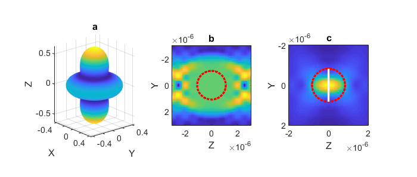
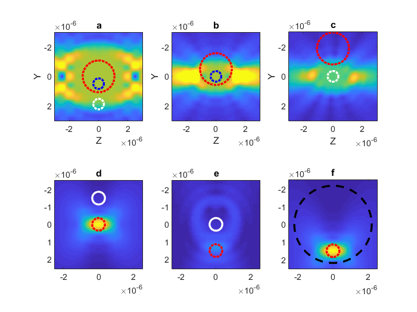
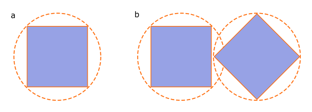
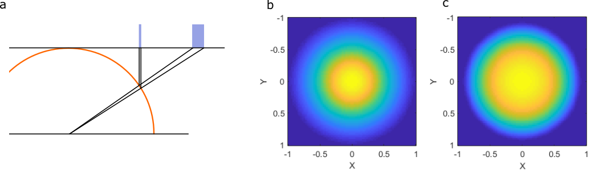
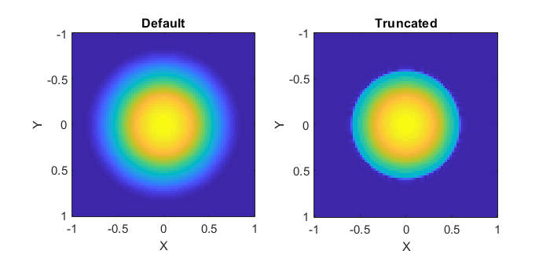

.. _conceptual-notes:

################
Conceptual Notes
################

This section provides more detailed information about various
concepts used in the toolbox.  It is a response to questions we have
received about the toolbox, its accuracy and various implementation
decisions.

.. contents:: Contents
   :depth: 3
   :local:

Spherical wave representation
=============================

The toolbox represents fields using a vector spherical wave function (VSWF)
basis.
This basis is infinite and, with infinite basis functions, it can be used
to represent any field.
However, in practice we are often forced to choose a finite number of
basis functions to approximate our field.
The accuracy of our approximation depends on how similar our field is
to the basis functions.
For example, in the VSWF basis we can exactly
represent the quadrapole field (see :numref:`conception-vswf-fields` a) with
only a single basis function (the dipole mode).
Conversely, a plane wave would need an infinite number of basis functions
to be represented exactly.

.. _conception-vswf-fields:

   Three different VSWF beams.
   (a) a quadrapole mode, visualised in the far-field.
   (b) a plane wave, only valid within the :math:`N_{max}` region
   shown by the red circle.
   (c) a Gaussian beam where most of the beam information passes
   through the aperture shown by the white line, the equivilant
   :math:`N_{max}` region is shown by the red circle.

For optical scattering calculations, we often don't need
to represent our field exactly everywhere: in most cases it is
sufficient to represent the field exactly only around the scattering object.
In a VSWF basis, we are able to accurately represent the fields in
spherical region located at the centre of our coordinate system.
The size of the region is determined by the number of
VSWF spherical modes, i.e. :math:`N_{max}`.
By choosing an appropriate :math:`N_{max}` we are able to represent
plane waves and other non-localised waves in a finite region surrounding
our particle, as shown in :numref:`conception-vswf-fields` b.
This can create some difficulty if our particle cannot be circumscribed
by such a sphere, as is the case for infinite slabs.
For modelling scattering by infinite slabs, it would be better to
use a plane wave basis.

For certain type of beams, such as focussed Gaussian beams, most of
the information describing the beam passes through an aperture with
a finite radius, as shown in :numref:`conception-vswf-fields` c.
These beams can be represented accurately as long as :math:`N_{max}`
is large enough to surround this aperture.
This is the condition used for automatic :math:`N_{max}` selection
in :class:`+ott.BscPmGauss`.

The accuracy of translated beam depends on the :math:`N_{max}` in
the translated region and the accuracy of the original beam around the
new origin.
For plane waves and other beams with infinite extent, this means that
translations outside the original :math:`N_{max}` region may not be
accurate.  For the case of plane waves, this can be circumvented by
implementing translations as phase shifts.
For Gaussian beams, as long as the original beam has a large enough
:math:`N_{max}` to accurately describe the beam, the beam can be translated
to almost any location (within the accuracy of the translation method).
This is illustrated in figure :numref:`conception-translation`.

Translations are not typically reversible.
If the beam is translated away from the origin, the translated
:math:`N_{max}` will need to be larger than the original
:math:`N_{max}` in order to contain the same information.
If the :math:`N_{max}` of the translated beam is not large enough,
the translation will be irreversible.

.. _conception-translation:

   Effect of regular translations on plane waves (a-c) and a
   focused Gaussian beam (d-f).  (a) shows a plane wave whose Nmax
   region is marked by the red dashed line.  The beam can be translated
   to the blue circle accurately, shown in (b), but cannot be translated
   to position outside the Nmax region such as the white circle shown in (c).
   In this case, the region in (c) is still fairly flat but the amplitude
   is not preserved.
   (d) show a Gaussian beam with :math:`N_{max} = 6` (red-line).
   The beam can be translated anywhere acurately, but the translation is
   only reversible if the new :math:`N_{max}` includes the origin as
   illustrated by (e) irreversible and (f) reversible.

The above discussion considered only incident beams.
For scattered beams, the scattering is described exactly by the
multipole expansion for the region inside the particle's :math:`N_{max}`
and the accuracy depends on how accurately the T-matrix models the
particle.
As soon as a scattered field is translated, the :math:`N_{max}` at the
new coordinate origin describes the region where the fields are
accurately approximated.

.. note:: This section is based on the user manual for OTT 1.2.
   The new text includes a discussion about non-square transations,
   i.e. different original and translated :math:`N_{max}`.

Scattering and the Rayleigh Hypothesis
======================================

In order to represent non-spherical particles with a T-matrix we assume
the particle scatters like an inhomogeneous sphere.
The T-matrix for the light scattered by this particle is typically
only valid outside the particle's circumscribing sphere.
This idea is illustrated in figure :numref:`conception-square-sphere` a.
For isolated particles, this doesn't normally cause a problem.
Care should be taken when simulating more than one particle when
the circumscribing spheres overlap, see
figure :numref:`conception-square-sphere` b; or when using the fields
within the circumscribing sphere.

.. _conception-square-sphere:

   (a) The T-matrix for a cube is calculated assuming a circumscribing
   sphere (illustrated by the outer circle).
   (b) Two particles whose circumscribing spheres overlap
   may cause numerical difficulties.

.. _conception-angular-scaling:

Point-matching and angle projections
====================================

Several of the beam generation functions in the toolbox support
different angular mapping/scaling factors for the projection between
the Paraxial far-field and the angular far-field.
These factors come about due to the unwrapping of the lens hemisphere
onto a plane.
Two possible unwrapping techniques are shown in
:numref:`conception-angular-scaling-image` along with the corresponding
fields for a Gaussian beam using these two unwrapping methods.
One technique (the ``tantheta`` option for :class:`+ott.BscPmGauss`)
results in more power at higher angles.
In the paraxial limit, both these methods produce similar results.
A realistic lens is likely somewhere between these two models;
at present not all OTT functions support arbitrary mapping functions.

.. _conception-angular-scaling-image:

   The difference in angular scaling comes from the projection between
   the lens hemisphere and the lens back-aperture.
   (a) shows an illustration of the difference in power for the
   sample angle with two mappings.
   (b) shows the projected field of a Gaussian beam back aperture
   with the :math:`sin(\theta)` mapping
   and (c) a :math:`tan(\theta)` mapping.

Beam truncation angle (for :class:`ott.BscPmGauss`)
===================================================

.. warning:: This section will move in a future release.

:class:`ott.BscPmGauss` can be used to simulate various Gaussian-like
beams.  By default, the class doesn't truncate the beams as a
normals microscope objective would, this can be seen in the following
example (shown in figure :numref:`conception-truncation-angle`)::

   figure();
   NA = 0.8;

   subplot(1, 2, 1);
   beam = ott.BscPmGauss('NA', NA, 'index_medium', 1.33);
   beam.basis = 'incoming';
   beam.visualiseFarfield('dir', 'neg');
   title('Default');

   subplot(1, 2, 2);
   beam = ott.BscPmGauss('NA', NA, 'index_medium', 1.33, ...
         'truncation_angle', asin(NA./1.33));
   beam.basis = 'incoming';
   beam.visualiseFarfield('dir', 'neg');
   title('Truncated');

.. _conception-truncation-angle:

   Example output from the :class:`ott.BscPmGauss` showing the
   far-field intensity patterns of two Gaussian beams with the
   same numerical aperture.  (left) shows the default output, where
   the Gaussian falls off gradually to the edge of the hemisphere.
   (right) shows a beam truncated, effectively simulating a
   microscope back-aperture.

