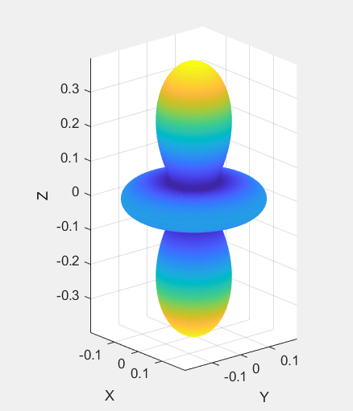
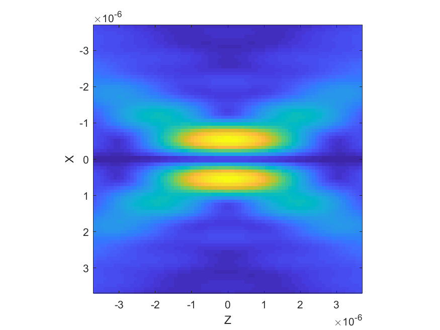
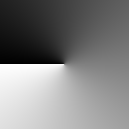
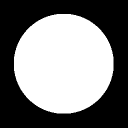

.. _creating-a-custom-beam:

######################
Creating a custom beam
######################

There are multiple ways to create your own beam in the toolbox. If your
beam can be described as a mixture of other beams already in the
toolbox, you can create the beam by simply adding these beams, see the
`combining beams <Combining-beams>`__ page. If you already have the beam
shape coefficients, the easiest way is to create a new instance of
``ott.Bsc``. If you don't know the coefficients but you know the near-
or far-field representation of the beam then you can use the static
functions in ``ott.BscPointmatch``.

A more complicated way to create your own beam is to create your own
class which inherits either from ``ott.Bsc`` or ``ott.BscPointmatch``.
This offers greater flexibility and allows you to easily add additional
checks on user input.

Using ``ott.Bsc`` directly
==========================

The ``ott.Bsc`` class can be instantiated with arrays of the beam shape
coefficients, this can be useful if you want to create a beam with
particular multipole components or if you are using another method to
calculate the beam shape coefficients. For example, to create a incoming
beam with only quadrapole coefficients:

.. code:: matlab

    a = [0, 0, 0, 0, 1, 0, 0, 0];  % [3 dipole, 5 quadrapole]
    b = 1i * a;
    basis = 'incoming';
    type = 'incident';
    beam = ott.Bsc(a, b, basis, type);

The ``ott.Bsc`` object can then be used with ``Tmatrix`` objects or for
visualisation of the beam:

.. code:: matlab

    figure();
    beam.visualiseFarfieldSphere('type', '3dpolar', 'field', 'E2')

   dipole beam visualization

Creating a beam with point matching
===================================

If you don't know the VSWF expansion of your beam but you are able to
calculate or measure the phase and amplitude in the near-field or
far-field, you can use ``ott.BscPointmatch`` or ``ott.BscPmParaxial``.
``ott.BscPointmatch`` contains two static methods for calculating the
beam shape coefficients from the near-fields or far-fields.
``ott.BscPmParaxial`` uses the far-field method from
``ott.BscPointmatch`` and provides the code to calculate the far-field
coordinates for a 2-D image of the fields at the back focal plane of the
objective.

``ott.BscPmParaxial`` in far-field
----------------------------------

This class can be used to create beam shape coefficients from images at
the back-aperture of the microscope objective. For this example, we will
use the following images for the phase and amplitude:

|phase pattern| |amplitude pattern|

These images may work better if spatial filtering is applied to remove
higher frequency components from the images, this can be achieved using
``imgaussfilt``. In this example, we are going to generate a circularly
polarised beam. To do this, we first load our images and assemble them
into a complex E field matrix:

.. code:: matlab

    % read, scale and convert to double (might need rgb2gray depending on file)
    imPhase = double(imread('phase.png')) ./ 255.0;
    imAmplitude = double(imread('amplitude.png')) ./ 255.0;

    E = imAmplitude;    % x polarisation
    E(:, :, 2) = 1i * imAmplitude;  % y polarisation
    E = E .* exp(1i * 2 * pi * imPhase);

For a vector beam, we could instead use separate images for the x and y
polarisation of each pixel. To use the ``BscPmParaxial`` class, we need
to provide the complex far-field matrix, the numerical aperture of the
beam, properties of the beam (such as wavelength and frequency), and a
mapping function describing how the image coordinates are mapped to the
spherical coordinates for the far-field of the beam.

The E-field matrix describes the field at the back aperture of the
objective. The matrix is mapped onto a hemisphere, with a maximum angle
defined by the numerical aperture of the objective. The centre of the
hemisphere corresponds to the centre of the images. The radial
coordinate extends from the centre of the image to the edge of the image
(the corners of the image do not contribute to the beam).
``BscPmParaxial`` supports the following mapping functions

  * ``'sintheta'`` (default) image radius proportional to ``sin(theta)``
  * ``'tantheta'`` image radius proportional to ``tan(theta)``
  * ``'theta'`` image radius proportional to ``theta`` where ``theta`` is
    the polar coordinate on the hemisphere.

.. code:: matlab

    index_medium = 1.0;
    wavelength0= 1064e-9;
    omega = 3e8 / wavelength0 * 2 * pi;
    NA = -1.0;   % sign of NA determines beam direction
    Nmax = 30;   % higher spatial frequencies require higher NA
    beam = ott.BscPmParaxial(NA, E, ...
        'index_medium', index_medium, ...
        'Nmax', Nmax, ...
        'wavelength0', wavelength0, ...
        'omega', omega);
    beam.basis = 'regular';
    figure();
    beam.visualise('axis', 'y');

   output beam

This method can be slow since the coefficient matrix for point matching
is calculated each time. To speed up the method for multiple beam
calculation, ``BscPmParaxial`` supports keeping the coefficient matrix.

.. code:: matlab

    beam1 = ott.BscPmParaxial(..., 'keep_coefficient_matrix', true);
    beam2 = ott.BscPmParaxial(..., 'beamData', beam1);

Far-field
---------

``ott.BscPointmatch/bsc_farfield`` can be used to calculate the beam
shape coefficients from the mode indices, coordinates and E-field. The
resulting BSC can be wrapped in an ``ott.Bsc`` object (see above).

.. code:: matlab

    % Calculate mode indices
    mode_indexes=[1:Nmax*(Nmax+2)].';
    [nn,mm]=ott.utils.combined_index(mode_indexes);

    % Calculate e_field in theta/phi coordinates
    [theta,phi]=ott.utils.angulargrid(2*(Nmax+1),2*(Nmax+1));
    e_field = ...;

    [a, b] = ott.BscPointmatch.bsc_farfield(nn, mm, e_field(:), theta(:), phi(:));

Near-field
----------

``ott.BscPointmatch/bsc_focalplane`` calculates the beam shape
coefficients in a Cartesian coordinate system centred around the focal
plane. To use the method, you must specify the mode indices, field
locations and field vectors in Cartesian coordinates.

.. code:: matlab

    % Calculate mode indices
    mode_indexes=[1:Nmax*(Nmax+2)].';
    [nn,mm]=ott.utils.combined_index(mode_indexes);

    % Calculate e_field
    [xx, yy, zz] = meshgrid(linspace(-1, 1), linspace(-1, 1), linspace(-1, 1));
    [r, theta, phi] = ott.utils.xyz2rtp(xx(:), yy(:), zz(:));
    kr = r .* 2 * pi / lambda;
    e_field = [Ex(:); Ey(:); Ez(:)];

    [a, b] = ott.BscPointmatch.bsc_focalplane(nn, mm, e_field, kr, theta, phi);

Custom ``ott.BscPointmatch`` class
----------------------------------

Although the ``bsc_focalplane`` and ``bsc_pointmatch`` functions can be
used directly, their use is rather cumbersome for regular use. In order
to offer a simplified interface for these objects you can inherit from
``ott.BscPointmatch``. This allows you to define all the methods needed
to create the beam within the class, directly set the beam shape
coefficients and provide a user interface which provides only physically
motivated parameters.

In this section we will go through an example of creating a
point-matching method for annular beams. For other examples, look at the
``ott.BscPm*`` class implementations.

All beam classes should inherit from ``ott.Bsc``. Point-matching beams
should implement from ``ott.BscPointmatch`` which inherits from
``ott.Bsc``. For our annular class we inherit from
``ott.BscPointmatch``. The outline for our class is shown bellow:

.. code:: matlab

    classdef BscPmAnnular < ott.BscPointmatch
      % Documentation...

      properties (SetAccess=protected)
        % Beam properties...
      end

      methods (Static)
        % Methods which can't access properties...
      end

      methods
        % Methods which can access properties
      end
    end

We declare the properties as ``SetAccess=protected``, this means that
the properties can only be set by functions defined in the class method
blocks. For annular beams, we define one property, the numerical
aperture describing the inner and outer radius of the annular.

.. code:: matlab

    properties (SetAccess=protected)
      NA     % Numerical aperture [r1, r2]
    end

To calculate the beam profile, we will implement a static method which
takes as input the two NA and outputs zeros or ones for the amplitude of
the beam:

.. code:: matlab

    methods (Static)
      function im = generatePattern(r1, r2)

        [xx, yy] = meshgrid(linspace(-1, 1), linspace(-1, 1));
        rr = sqrt(xx.^2 + yy.^2);

        im = double(rr > r1 & rr < r2);
      end
    end

The main method the user will use to interact with the beam is the
constructor. The constructor will include the numerical aperture and
optional named arguments. We use an ``inputParser`` to handle the named
arguments. For the beam wavenumber, we can use the
``ott.Bsc/parser_k_medium`` function.

.. code:: matlab

    methods
      function beam = BscPmAnnular(NA, varargin)

        % Call base class constructor
        beam = beam@ott.BscPointmatch();

        p = inputParser();
        p.addParameter('Nmax', 30);

        % Parameters for frequency and wavenumber
        p.addParameter('omega', 2*pi);
        p.addParameter('wavelength0', 1);
        p.addParameter('k_medium', []);
        p.addParameter('index_medium', []);
        p.addParameter('wavelength_medium', []);
        p.parse(varargin{:});

        % Store/get parameters
        Nmax = p.Results.Nmax;
        beam.k_medium = ott.Bsc.parser_k_medium(p, 2*pi);
        beam.omega = p.Results.omega;
        beam.NA = NA;

        if isempty(p.Results.index_medium)
          nMedium = 1.0;
        else
          nMedium = p.Results.index_medium;
        end

        % Calculate the radius from NA
        NAonm = NA/nMedium;
      
        % Calculate the pattern
        im = beam.generatePattern(NAonm(1), NAonm(2));

        % Calculate the coordinates in the far-field
        [xx, yy] = meshgrid(linspace(-1, 1), linspace(-1, 1));
        rr = sqrt(xx.^2 + yy.^2);
        phi = atan2(yy, xx);
        theta = asin(rr);

        % Remove points outside NA=1
        phi = phi(rr < 1);
        theta = theta(rr < 1);
        im = im(rr < 1);

        % Transform im into e_field
        Et = sign(cos(theta)).*cos(phi).*im;
        Ep = -sin(phi).*im;
        e_field=[Et(:); Ep(:)];

        % Calculate mode indices
        mode_indexes=[1:Nmax*(Nmax+2)].';
        [nn,mm]=ott.utils.combined_index(mode_indexes);

        % Calculate BSC
        [beam.a, beam.b] = ott.BscPointmatch.bsc_farfield(nn, mm, e_field(:), theta(:), phi(:));

        % Set other BSC properties
        beam.type = 'incident';
        beam.basis = 'regular';
      end
    end

This class doesn't implement exactly the same functionality as the
``ott.BscPmAnnular`` class, but it shows how a class could be
implemented to wrap the ``bsc_farfield`` method.

 Full class definition

.. code:: matlab

    classdef BscPmAnnular < ott.BscPointmatch
      % Documentation...
      
      properties (SetAccess=protected)
        NA     % Numerical aperture [r1, r2]
      end

      methods (Static)
        function im = generatePattern(r1, r2)

          [xx, yy] = meshgrid(linspace(-1, 1), linspace(-1, 1));
          rr = sqrt(xx.^2 + yy.^2);

          im = double(rr > r1 & rr < r2);
        end
      end

      methods
        function beam = BscPmAnnular(NA, varargin)

          % Call base class constructor
          beam = beam@ott.BscPointmatch();

          p = inputParser();
          p.addParameter('Nmax', 20);

          % Parameters for frequency and wavenumber
          p.addParameter('omega', 2*pi);
          p.addParameter('wavelength0', 1);
          p.addParameter('k_medium', []);
          p.addParameter('index_medium', []);
          p.addParameter('wavelength_medium', []);
          p.parse(varargin{:});

          % Store/get parameters
          Nmax = p.Results.Nmax;
          beam.k_medium = ott.Bsc.parser_k_medium(p, 2*pi);
          beam.omega = p.Results.omega;
          beam.NA = NA;

          if isempty(p.Results.index_medium)
            nMedium = 1.0;
          else
            nMedium = p.Results.index_medium;
          end

          % Calculate the radius from NA
          NAonm = NA/nMedium;

          % Calculate the pattern
          im = beam.generatePattern(NAonm(1), NAonm(2));

          % Calculate the coordinates in the far-field
          [xx, yy] = meshgrid(linspace(-1, 1), linspace(-1, 1));
          rr = sqrt(xx.^2 + yy.^2);
          phi = atan2(yy, xx);
          theta = asin(rr);

          % Remove points outside NA=1
          phi = phi(rr < 1);
          theta = theta(rr < 1);
          im = im(rr < 1);

          % Transform im into e_field
          Et = sign(cos(theta)).*cos(phi).*im;
          Ep = -sin(phi).*im;
          e_field=[Et(:); Ep(:)];

          % Calculate mode indices
          mode_indexes=[1:Nmax*(Nmax+2)].';
          [nn,mm]=ott.utils.combined_index(mode_indexes);

          % Calculate BSC
          [beam.a, beam.b] = ott.BscPointmatch.bsc_farfield(nn, mm, e_field(:), theta(:), phi(:));

          % Set other BSC properties
          beam.type = 'incident';
          beam.basis = 'regular';
        end
      end
    end

Creating a custom ``Bsc`` class
===============================

For other beam shape coefficient definitions, it is possible to create a
custom class which inherits from ``ott.Bsc``. The implemention for this
class will be very similar to the ``BscPmAnnular`` class shown above.
For examples, see ``ott.BscBessel`` and ``ott.BscPlane``.

.. code:: matlab

    classdef BscCustomClass < ott.Bsc
      % Documentation...

      properties (SetAccess=protected)
        % Beam properties...
      end

      methods (Static)
        % Methods which can't access properties...
      end

      methods
        % Methods which can access properties

        function beam = BscCustomClass()
          
          % Call the base class constructor
          beam = beam@ott.Bsc();

          % Implementation...
        end
      end
    end

