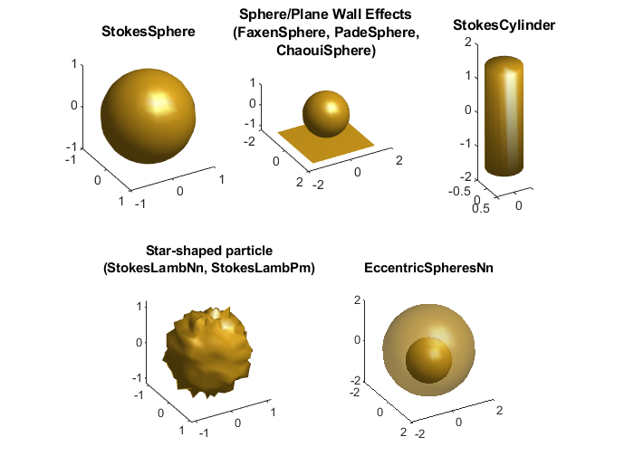

.. automodule:: +ott.+drag

.. _drag-package:

##############
`drag` Package
##############

The `drag` package provides methods for calculating Stokes drag for
spherical and non-spherical particles in unbounded free fluid and
methods to calculate the wall effects for spheres near walls and
eccentric spheres.
These methods assume `Stokes flow (creeping flow)
<https://en.wikipedia.org/wiki/Stokes_flow>`_ (i.e., low Reynolds number).

All drag methods inherit from :class:`Stokes`.  The simplest way to
construct the drag tensor for a set of shapes is to call the static
method :meth:`Stokes.FromShape` with the geometry, for example::

   shape = ott.shapes.Sphere();
   drag = ott.drag.Stokes.FromShape(shape);

:meth:`Stokes.FromShape` can also be called with arrays of shapes.
In this case, the method will attempt to generate an array of drag
tensors for the specified configuration and raise a warning or error
when the configuration is unlikely to behave as expected.

Classes in this package can be classified into two main categories:
methods for :ref:`free-particles` and methods for :ref:`wall-effects`.
A summary of these classes is shown graphically in
:numref:`package-overview-drag`.

.. _package-overview-drag:

   Graphical display of different particle shapes/scenarious for
   which drag methods are provided.  Other shapes/geometries can
   be approximated by choosing one of the above drag methods.

.. contents:: Contents
   :depth: 3
   :local:
..

Generic classes
===============

The base class for all drag tensors is the :class:`Stokes` class.
This class specifies the common functionality for drag tensors and
provides the static method for creating drag tensors from shape arrays.

The :class:`StokesData` class is an instance of the :class:`Stokes` class
which provides data storage of the drag and inverse drag tensors.
Unlike other classes, which compute the drag tensors as needed, the
:class:`StokesData` class stores the drag tensors.
All other classes can be cast to the :class:`StokesData` class using::

   dragData = ott.drag.StokesData(drag);

This operation performs all drag calculations and applies any rotations
to the particle; this may provide a performance improvement if the
same drag is needed for repeated calculations.

Stokes (base class)
-------------------

.. autoclass:: Stokes
   :members: Stokes, FromShape

StokesData
----------

.. autoclass:: StokesData
   :members: StokesData

.. _free-particles:

Free particles
==============

These classes calculate drag tensors for particles in unbounded free fluid.
Spheres have an analytical solution and can be calculated using
:class:`StokesSphere`.
Arbitrary shapes can be calculated in spherical
coordinates using point-matching using Lamb Series via :class:`StokesLambPm`.
:class:`StokesLambNn` is a pre-trained neural network for the Lamb
series solution for arbitrary shaped particles which enables faster
drag prediction with comparable accuracy to :class:`StokesLambPm`.
For Cylinders or elongated particles with high aspect ratios it may
be better to use the :class:`StokesCylinder` approximation instead.

StokesSphere
------------

.. autoclass:: StokesSphere
   :members: StokesSphere

StokesCylinder
--------------

.. autoclass:: StokesCylinder
   :members: StokesCylinder

StokesLambNn
------------

.. autoclass:: StokesLambNn
   :members: StokesLambNn

StokesLambPm
------------

.. autoclass:: StokesLambPm
   :members: StokesLambPm

.. _wall-effects:

Wall effects
============

The toolbox includes several approximation methods for calculating
drag for spheres near walls.
The :class:`EccentricSpheresNn` can be used to simulate a sphere inside
another sphere or by making the outer sphere radius significantly larger
than the inner sphere, a sphere near a wall.
:class:`FaxenSphere`, :class:`ChaouiSphere` and :class:`PadeSphere`
provide drag tensors for spheres near walls with varying approximations.
:class:`FaxenSphere` may provide slightly faster calculation time
compared to the other methods but only works well when the particle
is a fair distance from the wall.

EccentricSpheresNn
------------------

.. autoclass:: EccentricSpheresNn
   :members: EccentricSphereNn

FaxenSphere
-----------

.. autoclass:: FaxenSphere
   :members: FaxenSphere

PadeSphere
----------

.. autoclass:: PadeSphere
   :members: PadeSphere

ChaouiSphere
------------

.. autoclass:: ChaouiSphere
   :members: ChaouiSphere

Abstract base classes
=====================

In addition to the :class:`Stokes` abstract base class, the following
classes can also be used for implementing custom drag classes.

StokesSphereWall
----------------

.. autoclass:: StokesSphereWall
   :members: StokesSphereWall, FromShape

StokesStarShaped
----------------

.. autoclass:: StokesStarShaped
   :members: StokesStarShaped, FromShape

