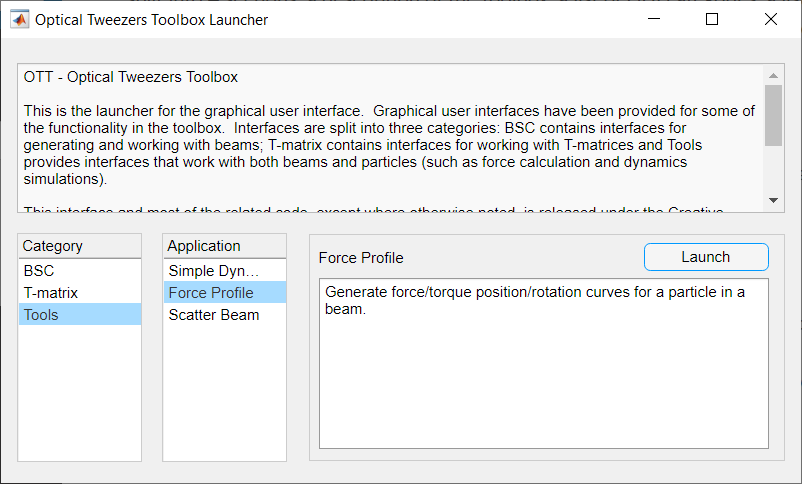

.. _getting-started:

###############
Getting Started
###############

This section has information about getting started with the toolbox
including information on `installation <#installation>`__,
`using the GUIs <#exploring-the-toolbox-with-the-gui>`__
and `running the example files <#running-the-examples>`__.
This section also contains a brief
`overview of the toolbox <#toolbox-overview>`__, further
information can be found in the papers listed in
:ref:`further-reading`.

Installation
============

To use the toolbox, you will need a recent version of Matlab (at
least R2016b; R2018a is needed for some features; Octave should also work)
and the latest version of OTT.
There are a couple of ways to get OTT.
You can download one of the Matlab toolbox files (with the ``.mltbx``
file extension), or download one of the ``.zip`` archives containing
the source code, or download the latest source directly from GitHub.
If you are using Matlab, the easiest method is to install OTT via
the Addons explorer.
The following sub-sections detail each of these methods.

Installing via Matlab Addons Explorer
-------------------------------------

If using Matlab, the easiest method to install the toolbox is using
the Matlab Addons explorer.
Simply launch Matlab and navigate to **Home** > **Addons** > **Get-Addons**
and search for
"Optical Tweezers Toolbox".  Then, simply click the
*Add from GitHub* button to automatically download the package and
add it to the path.
You may need to logging to a Mathworks account to complete this step.

Using a ``.mltbx`` file
-----------------------

You can download the latest stable release of OTT from either the
`GitHub release page <https://github.com/ilent2/ott/releases>`__.
Simply download the appropriate ``.mltbx`` file for the relevant version.
Once downloaded, execute the file and follow the instructions to install
the toolbox.

To change/remove the toolbox, go to **Home** > **Add-ons**
> **Manage Add-ons** and select the toolbox you would like to configure.

Using a ``.zip`` or cloning the repository
------------------------------------------

The latest version of OTT can be downloaded from the
`OTT GitHub page <https://github.com/ilent2/ott>`__.
Simply click the *Clone or Download* button and select your
preferred method of download.
The advantage of cloning the GitHub repository is you can easily switch
between different versions of the toolbox or download the most recent
changes/improvements to the toolbox.
There are a range of online tutorials for getting started with
git and GitHub, for example
https://product.hubspot.com/blog/git-and-github-tutorial-for-beginners.

If you are cloning the repository you can checkout different
tags to select the desired release.
Alternatively, for a specific release, navigate to the
`release page <https://github.com/ilent2/ott/releases>`__
and select the ``.zip`` file for the desired release.

To install OTT, download the latest version of the toolbox to your
computer, if you downloaded a ``.zip`` file, extract the files to
your computer.

Once downloaded, most of the toolbox functionality is ready to use. To
start exploring the functionality of the toolbox immediately, you can
run the ``examples``.
To use the graphical user interface or add the toolbox to your own code,
you will need to make Matlab aware of the toolbox path.
To do this, simply run

.. code:: matlab

    addpath('/path/to/toolbox/ott');

Replace the path with the path you placed the downloaded toolbox in. The
folder must contain the ``+ott`` directory and the ``docs`` directory.
If you downloaded the latest toolbox from GitHub, the final part of the
pathname will either be the repository path (if you used ``git clone``)
or something like ``ott-master`` (if you downloaded a ZIP). The above
line can be added to the start of each of your files or for a more
permanent solution you can add it to the `Matlab startup
script <https://au.mathworks.com/help/matlab/ref/startup.html>`__.

Post installation
-----------------

To check that ``ott`` installed correctly and can be found by Matlab,
run the following command and verify it displays the contents of the
``+ott/Contents.m`` file

.. code:: matlab

   help ott

If you have multiple versions of ``ott`` installed, you may want to
check which version is currently being used.
The following command can be used to check the path of the
toolbox currently being found

.. code:: matlab

   what ott

Further information about using the toolbox functions and graphical
user interface can be found in subsequent sections.

The toolbox runs on recent versions of Matlab, most functionality
should work on at least R2016b but the graphical user interface might
need R2018a or newer (we have tested the toolbox on R2018a).
Most functionality should work with
[GNU Octave](https://www.gnu.org/software/octave/), however this
has not been tested recently and performance is optimised for Matlab.

Some functionality may require additional dependences including
additional Matlab products.
We are currently working on a full list; feel free to get in contact
if you encounter problems with missing dependencies.
In some cases it is possible to re-write functions to avoid using
specific Matlab toolboxes. If you encounter difficultly using a function
because of a missing Matlab toolbox, let us know and we may be able to
help.

Toolbox Overview
================

The toolbox includes a collection of functions and classes for calculating
optical forces and torques for particles in various light fields.
The core toolbox files are grouped into a Matlab package (a folder with
a `+` prefix).  Other components, including examples and documentation,
are provided in separate folders in the directory where OTT was
downloaded/installed.
If you installed OTT by downloading a ``.zip`` or cloning the repository,
the OTT path is the directory containing the ``+ott`` and ``docs``
directories.
If you installed OTT with a Matlab package or via the Addons explorer,
you can view the OTT directory containing the docs and examples
by navigating to **Home** > **Addons** > **Manage addons**, find the
toolbox and select **Options** > **Open folder**.

The following list provides a brief overview of the toolbox parts
and the corresponding folders/file paths:

**Examples** (`<ott-path>/examples`)
  This directory contains examples of various features included in
  the toolbox.  Most of these examples are described in the
  :ref:`examples` part of the documentation and information on
  `running the example files <#running-the-examples>`__ can be
  found bellow.

**Graphical user interface** (`+ott/+ui`)
  This sub-package contains the graphical user interface components.
  See bellow for information on
  `using the GUIs <#exploring-the-toolbox-with-the-gui>`__.

**BSC and T-matrix classes** (`+ott/Bsc*` and `+ott/Tmatrix*`)
  The BSC and T-matrix classes represent beams and particles in the
  toolbox.  In the vector spherical wave function (VSWF) basis,
  beams are represented by vectors describing a superposition of
  VSWF components and particles are represented by matrices
  which operate on beam-vectors to produce scattered beam-vectors.
  The BSC and T-matrix classes behave like regular Matlab
  vector and matrix classes but also provide additional functionality
  such as functions for visualising fields
  and beam related properties (wavelength, numerical aperture, etc.).
  Further details can be found in the
  :ref:`bsc-classes` and :ref:`tmatrix-classes` reference pages.

**Functions operating on beams and particles** (`+ott/*` functions)
  In addition to the BSC and T-matrix classes, the `+ott` package
  contains a range of other functions for calculating forces
  and locating traps.
  Further information can be found in :ref:`other-functions`.

**Geometric Shapes** (`+ott/+shapes`)
  This sub-package provides descriptions of Geometric shapes
  which are used mostly by the point-matching and DDA routines for
  generating T-matrices for particles.
  See :ref:`shapes-package` reference pages for more information.

**Utility functions** (`+ott/+utils`)
  This directory contains functions commonly used by other parts of
  the toolbox.  Most users will probably not need to access these
  directly.
  See :ref:`utils-package` reference pages for more information.

**Documentation** (`<ott-path>/docs`)
  This directory contains the restructured text (ReST) used to generate
  this documentation.  If you don't have or prefer not to use a web
  browser to view the documentation, you can open these files in most
  regular text editors.

**Unit tests** (`<ott-path>/tests`)
  This directory contains functions and scripts for testing the
  toolbox functionality.  This is only included in the GitHub version
  and you should not need to interact with this directory unless you
  are contributing to OTT.

The toolbox doesn't use any particular units, although most examples will
assume units of dimensionless force :math:`F_Q` and torque
:math:`\tau_Q` efficiencies.  To convert to SI units:

.. math::

   F_{SI} = F_{Q} \frac{nP}{c}

   \tau_{SI} = \tau_{Q} \frac{P}{\omega}

where :math:`n` is the refractive index of the medium,
:math:`P` is the beam power, :math:`c` is the speed of light in
vacuum, and :math:`\omega` is the optical frequency.
You should be able to use any units as long as you are consistent
with defining parameters.  However, this hasn't been thoroughly tested,
if you encounter any inconsistencies, please let us know.

To learn more about how the toolbox calculates forces and torques,
take a look at the original paper describing OTT

   T. A. Nieminen, V. L. Y. Loke, A. B. Stilgoe, G. Knöner, A. M.
   Branczyk, N. R. Heckenberg, and H. Rubinsztein-Dunlop, "Optical
   tweezers computational toolbox", `Journal of Optics A 9, S196-S203
   (2007) <http://iopscience.iop.org/1464-4258/9/8/S12/>`__

Exploring the toolbox with the GUI
==================================

The toolbox includes a graphical user interface (GUI) for performing
many of the basic tasks including generating beams, T-matrices and
calculating force profiles.
The user interface can be used to explore the basic functionalities
of the toolbox without writing a single line of code.
The GUIs can be accessed by running the OTSLM Launcher application.
The launcher can be found in the **Apps** menu (if OTSLM was installed
using a ``.mltbx`` file), or run from the file explorer by navigating
to the ``+ott/+ui`` directory and running ``Launcher.mlapp``.
Alternatively, you can launch the GUI from the command window with

.. code:: matlab

   ott.ui.Launcher

If everything is installed correctly, the launcher should appear,
as depicted in :numref:`launcher-overview`.
The window is split into 4 sections: a description of the toolbox, a
list of GUI categories, a list of applications, and a description about
the selected application. Once you select an application, click Launch.

.. _launcher-overview:

   Overview of the Launcher application.

BSC and T-matrix generation function need to specify a variable name.
This variable name is used when assigning the object data to the
Matlab workspace.
Other GUIs which support output can also specify a variable name.
Output from one GUI can be used as input to another GUI by specifying
the corresponding variable name as the input.

If an app produces an error or warning, these will be displayed in the
Matlab console.

For a complete example showing how to use the GUI, see
:ref:`calculating-forces-with-the-gui`

Running the examples
====================

To run the examples, navigate to the examples directory, either following
the instructions above or using the ``what`` command:

.. code:: matlab

   what_result = what('ott');
   ott_path = fileparts(what_result(end).path);
   cd([a, '/examples']);

To run an example, open the script and run it (either the full file
or section-by-section).
The first line in most script files is ``addpath('../')``, this line
ensure OTT is added to the path.  If you have already added OTT to the
path or installed OTT as an Add-on, this line is unnecessary.
If you copy the example to another directory, you will need to adjust
the ``addpath`` command accordingly.

Further documentation and example output for specific examples can be
found in :ref:`examples`.

