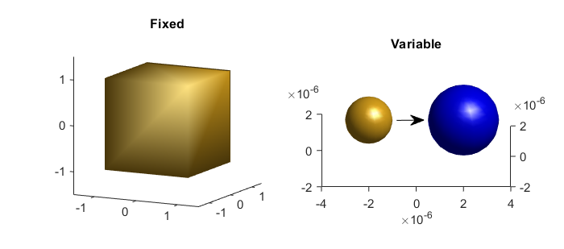

.. automodule:: +ott.+particle

.. _particle-package:

##################
`particle` Package
##################

The `particle` package provides classes which represent OTT particles.
:class:`Particle` instances combine the optical scattering method and
drag calculation method into a single representation.  There are currently
two specialisations of :class:`Particle`, summarised in
:numref:`package-overview-particle`: :class:`Fixed` stores
the geometry, T-matrix and drag for a particle; :class:`Variable`
re-calculates the T-matrix and drag whenever the refractive index of
particle geometry changes.

Unlike :class:`ott.tmatrix.Tmatrix` instances, :class:`Particle` instances
use SI units (i.e., the particle geometry and position uses units of meters).

In a future version this interface may change to support other scattering
methods, and/or more optimal T-matrix calculation methods (such as only
building required columns of the T-matrix depending on the incident beam).

.. _package-overview-particle:

   Graphical display of the two different particle representations: fixed,
   which represents a constant particle; and variable, which represents
   a particle whose properties dynamicaly change.

.. contents:: Contents
   :depth: 3
   :local:
..

Particle
========

.. autoclass:: Particle
   :members: surf

Fixed
=====

.. autoclass:: Fixed
   :members: Fixed, FromShape

Variable
========

.. autoclass:: Variable
   :members: Variable, FromShape, Sphere, StarShaped

