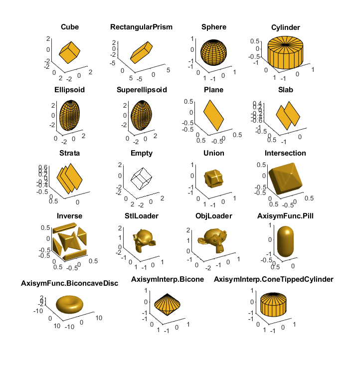

.. automodule:: +ott.+shape

.. _shapes-package:

###############
`shape` Package
###############

The `shape` package provides a collection of simple geometric shapes,
methods for building arbitrary geometric shapes from functions/points, and
methods to load geometry from files.
The following sections describe the different shapes currently include
in the toolbox.
Additional shapes can be created using the shape builders or by
sub-classing :class:`Shape` to define a new shape class.

The basic shapes currently included in the toolbox focus on simple
geometries and shapes of particles commonly trapped in optical tweezers.
A summary of the different shapes and methods currently included is
shown in :numref:`package-overview-shapes`.
The package is split into four main sections:
:ref:`simple-geometric-shapes`, :ref:`shape-builders`,
:ref:`file-loaders` and :ref:`collections`.
The shape builders can be used to create arbitrary shapes from sets of
vertices or parametric functions.
In addition to the simple geometric shapes, some of the shape builder
classes define static methods for building other commonly used shapes.
More complex shapes can be created
in external CAD programs (such as `Blender <https://www.blender.org/>`_)
and loaded using the file loaders.
The shape sets can be used to combine shapes or invert geometries.

.. _package-overview-shapes:

   Graphical display of the different shape creation methods currently
   included in the toolbox.  Plot titles correspond to shapes classes
   and static methods of shapes classes.
   Most methods display the default geometry generated using `surf`.
   File loaders show different views of the suzane mesh; Empty is
   reprsented by a face-less cube; and collections show combinations
   of cubes.

The design of the shape classes is motivated by the scattering methods.
Most scattering methods involve surface integrals, volume integrals
or calculation of surface normals.
These classes describe geometries with these quantities in mind.
The complexity of various scattering simulations can often be reduced
when the particle is star shaped, mirror symmetric or rotational symmetric.
Consequently, all shapes have methods for querying these properties,
although they may not be implemented for certain shapes (check documentation).

.. contents:: Contents
   :depth: 3
   :local:
..

Base class
==========

The base class for all OTT shapes is the :class:`Shape` class.
This class defines the interface expected by most of the scattering
methods.
You will probably only need to use this class directly when
implementing complex custom shapes.
For simpler custom shapes, see the :ref:`shape-builders`.
Additional classes describing additional conditions on shape geometry
or helpers for defining commonly used methods can be found in the
:mod:`ott.shapes.mixin` package.

Shape
-----

.. autoclass:: Shape
   :members: Shape, not, or, and, getBoundingBox, writeWavefrontObj,
      intersect, voxels, surf, isosurface, insideRtp, insideXyz,
      normalsRtp, normalsXyz

.. _simple-geometric-shapes:

Simple geometric shapes
=======================

Cube
----

.. autoclass:: Cube
   :members: Cube

RectangularPrism
----------------

.. autoclass:: RectangularPrism
   :members: RectangularPrism

Sphere
------

.. autoclass:: Sphere
   :members: Sphere

Cylinder
--------

.. autoclass:: Cylinder
   :members: Cylinder

Ellipsoid
---------

.. autoclass:: Ellipsoid
   :members: Ellipsoid

Superellipsoid
--------------

.. autoclass:: Superellipsoid
   :members: Superellipsoid

Plane
-----

.. autoclass:: Plane
   :members: Plane

Slab
----

.. autoclass:: Slab
   :members: Slab

Strata
------

.. autoclass:: Strata
   :members: Strata

Empty
-----

.. autoclass:: Empty
   :members: Empty

.. _shape-builders:

Shape builders
==============

TriangularMesh
--------------

.. autoclass:: TriangularMesh
   :members: TriangularMesh

PatchMesh
---------

.. autoclass:: PatchMesh
   :members: PatchMesh

AxisymInterp
------------

.. autoclass:: AxisymInterp
   :members: Bicone, ConeTippedCylinder, AxisymInterp

AxisymFunc
----------

.. autoclass:: AxisymFunc
   :members: BiconcaveDisc, Pill, AxisymFunc

.. _file-loaders:

File loaders
============

For more complex shapes, it is often more convinent to work with a
dedicated computer aided design (CAD) program such as
`Blender <https://www.blender.org/>`_.
The toolbox currently includes two types of commonly used CAD formats:
STL and Wavefront OBJ.

StlLoader
---------

.. autoclass:: StlLoader
   :members: StlLoader

ObjLoader
---------

.. autoclass:: ObjLoader
   :members: ObjLoader

.. _collections:

Collections
===========

These classes can be used for combining or modifying existing geometry.
For example, to combine two shapes so that all points inside either
shape are considered inside the combined shape, use a union::

   shape = shape1 | shape2;

Or, to create a shape from the intersection of two shapes, use::

   shape = shape1 & shape2;

To invert the inside/outside of a shape, use the inverse::

   shape = ~shape;

Set
---

.. autoclass:: Set
   :members: Set

Union
-----

.. autoclass:: Union
   :members: Union

Intersection
------------

.. autoclass:: Intersection
   :members: Intersection

Inverse
-------

.. autoclass:: Inverse
   :members: Inverse

