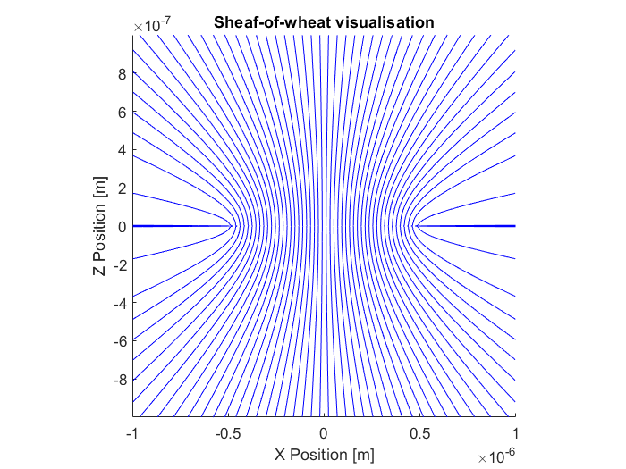

############################
Simulating vaterite with DDA
############################

This section is a companion for the ``examples/dda_vaterite.m`` script
and will guide you through simulating an inhomogeneous particle using
the discrete dipole approximation.
The script simulates the vaterite particles described in

   Highly birefringent vaterite microspheres: production,
   characterization and applications for optical micromanipulation.
   S. Parkin, et al., Optics Express Vol. 17, Issue 24, pp. 21944-21955 (2009)
   https://doi.org/10.1364/OE.17.021944

These particles are made of a uniaxial birefringent material.
The crystal axis is aligned according to a sheaf-of-wheat structure,
shown in figure :numref:`vaterite-sheaf-of-wheat`.
In order to simulate this particle, we need to specify the
polarizability of each dipole (computational unit cell).

.. _vaterite-sheaf-of-wheat:

   Illustration of the vaterite sheaf of wheat structure.  The
   image shows a slice through the XZ plane.  The particle is rotaionly
   symmetry about the Z axis and mirror symmetric about the XY plane.

Describing the vaterite properties
==================================

To describe the vaterite shape, we use :class:`+ott.+shapes.Sphere`.
DDA requires the shape to be specified using voxels, for this we used
:meth:`+ott.+shapes.Sphere.voxels` to calculate voxels on a grid with
a regular spacing.

.. code:: matlab

   spacing = wavelength0 / 10;
   radius = wavelength0;
   shape = ott.shapes.Sphere(radius);
   voxels = shape.voxels(spacing, 'even_range', true);

The ``even_range`` parameter tells the voxels function to use an even
number of points for the size of each voxel grid dimension.
This means that the voxel grid will not place voxels at the origin
making it easier to use mirror and rotational symmetry options for DDA.

To calculate the polarizability for a unit cell we use the method
based on the lattice dispersion relation from
:mod:`+ott.+utils.+polarizability`.
Vaterite is a uniaxial crystal with an ordinary and extraordinary
refractive index, ``index_o`` and ``index_e`` respectively.

.. code:: matlab

   upol = ott.utils.polarizability.LDR(spacing ./ wavelength0, ...
      [index_o; index_o; index_e] ./ index_medium);

To generate the sheaf of wheat structure we used the ``sheafOfWheat``
function defined in the script to calculate the orientation direction
of each unit cell.

.. code:: matlab

   dirs = sheafOfWheat(voxels, 0.5*radius);

Finally, we rotate the polarisability and refractive index so the
``z`` direction aligns with the sheaf-of-wheat direction

.. code:: matlab

    index_relative = ott.utils.rotate_3x3tensor(...
        diag([index_o, index_o, index_e] ./ index_medium), 'dir', dirs);
    polarizabilities = ott.utils.rotate_3x3tensor(...
        diag(upol), 'dir', dirs);

Calculating the T-matrix with DDA
=================================

Once all the properties have been described, we construct the T-matrix
using :class:`+ott.TmatrixDda`.  We use the class constructor rather than
:meth:`+ott.TmatrixDda.simple` in order to specify the polarizability of
each voxel.  If we wanted to simulate a homogeneous sphere we could use
the simple method.

.. code:: matlab

   Tmatrix = ott.TmatrixDda(voxels, ...
        'polarizability', polarizabilities, ...
        'index_relative', index_relative, ...
        'index_medium', index_medium, ...
        'spacing', spacing, ...
        'z_rotational_symmetry', 4, ...
        'z_mirror_symmetry', true, ...
        'wavelength0', wavelength0, ...
        'low_memory', low_memory);

Most of the arguments are fairly intuitive: we specify the material properties
and voxel locations with ``voxels`` and ``polarizabilities``.
When ``polarizabilities`` are specified explicitly, we still need to
specify ``index_relative`` in order to ensure correct scaling of the
resulting T-matrix.
The ``z_rotational_symmetry`` argument tells the DDA implmenetation to
use fourth order rotational symmetry about the z-axis and the
``z_mirror_symmetry`` says to use mirror symmetry about the XY plane.
The low memory option can be used with rotational symmetry or mirror
symmetry to reduce the amount of memory required at a slight reduction
to computational efficiency.
``spacing`` is currently only used for the ``Nmax`` estimation.
If the polarizabilities were not specified, ``spacing`` would also
be used for calculating the polarizabilities from ``index_relative``.
``wavelength0`` and ``index_medium`` specify the units for distance,
i.e. the scaling that should be applied to ``voxels``.

Depending on the size of the particle and the number of dipoles,
this could take anywhere from a couple of minutes to several hours to run.
An alternative is to only calculate modes which are present in the
illuminating beam, this can be achieved using the ``modes`` option, for
examples, to a beam with only ``m = 1`` modes you could do

.. code:: matlab

   Nmax = 5;
   m = 1;
   n = max(1, abs(m)):Nmax;
   modes = [n(:), repmat(m, size(n(:)))];

   Tmatrix = ott.TmatrixDda(voxels, ...
      'modes', modes);

The above could also be used to calculate the T-matrix in parallel by
specifying a different mode for each worker to calculate and then
combining the T-matrix columns after calculation.

If you are calculating large T-matrices, you will probably want to
save them to a file so you can use them again later without needing
to rerun DDA.
For this, simply use the ``save`` command

.. code:: matlab

   save('output.mat', 'Tmatrix')

To load the T-matrix back into Matlab, first make sure OTT is on the
matlab path and then either double click on the ``.mat`` file or run

.. code:: matlab

   load('output.mat')

Calculating torque on the particle
==================================

The calculated T-matrix can be used like any other T-matrix object.
For example, we can create a beam and calculate the torque on the
particle at different locations in the beam:

.. code:: matlab

   beam = ott.BscPmGauss('NA', 1.1, 'index_medium', index_medium, ...
      'power', 1.0, 'wavelength0', wavelength0, 'polarisation', [1, -1i]);

   [~, tz] = ott.forcetorque(beam, Tmatrix, ...
       'position', [0;0;0], 'rotation', eye(3));

