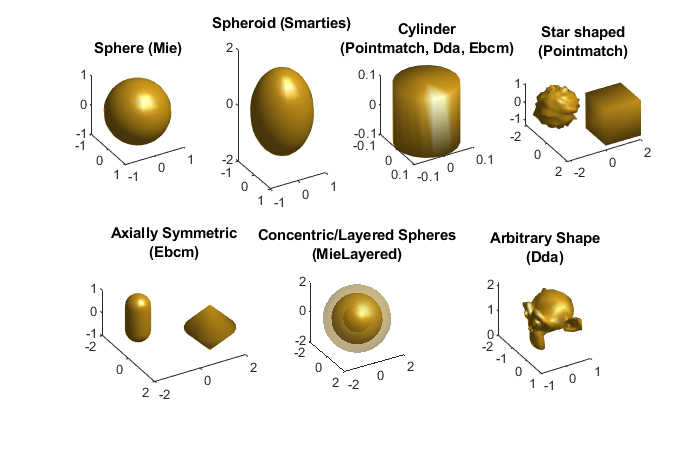

.. automodule:: +ott.+tmatrix

.. _tmatrix-package:

#################
`tmatrix` Package
#################

The `tmatrix` package provides methods for calculating how particles
scatter light via the T-matrix method.
The main class in this package is :class:`Tmatrix` which provides methods
for manipulating the T-matrix data.
The data is stored internally as a matrix, allowing the type to be changed
to any valid Matlab matrix type (such as ``gpuArray`` or ``sparse``).

Other classes in this package provide methods for calculating T-matrices
using different approximations, these methods are summarised in
:numref:`package-overview-tmatrix`.
Most of these classes have a ``FromShape`` method which can be used to
calculate the T-matrix from a geometric shape description.
Once the T-matrix is calculated, it can be multiplied by a
:class:`ott.bsc.Bsc` object to calculate the scattered or internal fields.

The package also contains two sub-packages: :mod:`+smatries` contains
components of `SMARTIES <https://doi.org/10.1016/j.jqsrt.2016.01.005>`_
which are used in :class:`Smarties`;
and the :mod:`+dda` sub-package contains components of a discrete dipole
approximation implementation that will eventually move into OTTv2 (currently
used only by :class:`Dda`).

.. _package-overview-tmatrix:

   Graphical display of different particle shapes and the corresponding
   T-matrix methods that might be suitable for modelling them.
   The accuracy of the resulting T-matrix often depends on the size and
   aspect ratio of the particle as well as the choosen method.

.. contents:: Contents
   :depth: 3
   :local:
..

Tmatrix
=======

.. autoclass:: Tmatrix
   :members: Tmatrix, FromShape, issparse, full, sparse, makeSparse,
      setNmax, shrinkNmax, gpuArray, gather, setType, columnCheck,
      mergeCols, times, mtimes, rdivide, plus, minus, real, imag, diag

Dda
===

.. autoclass:: Dda
   :members: Dda, FromShape, DefaultPmrtp, DefaultProgressCallback

Ebcm
====

.. autoclass:: Ebcm
   :members: Ebcm, FromShape

Mie
===

.. autoclass:: Mie
   :members: Mie, FromShape, ShapeVolume, ShapeMaxRadius

MieLayered
==========

.. autoclass:: MieLayered
   :members: MieLayered, FromShape

Pointmatch
==========

.. autoclass:: Pointmatch
   :members: Pointmatch, FromShape, DefaultProgressCallback

Smarties
========

.. autoclass:: Smarties
   :members: Smarties, FromShape

Sub-packages
============

These sub-packages are used by T-matrix calculation methods and
only minimal documentation is provided.
Their location may change in a future releases (for instance, when DDA
is extended to include force calculation methods).

.. automodule:: +ott.+tmatrix.+smarties

SMARTIES
--------

Contains components of the SMARTIES package for easy installation with
the optical tweezers toolbox.
Users interested in SMARTIES may want to download the full version, for
details see 

   Somerville, Auguié, Le Ru.  JQSRT, Volume 174, May 2016, Pages 39-55.
   https://doi.org/10.1016/j.jqsrt.2016.01.005

.. automodule:: +ott.+tmatrix.+dda

DDA
---

.. autoclass:: Dipole
   :members: Dipole, efield, efarfield, efarfield_matrix, mtimes, setDipoles

.. autoclass:: Dda
   :members: Dda, FromShape, interaction_matrix, solve

.. autoclass:: DdaHighMem
   :members: DdaHighMem, FromShape, update_interaction_matrix

.. automodule:: +ott.+tmatrix.+dda.+polarizability

DDA polarizability methods
--------------------------

.. autofunction:: CM
.. autofunction:: LDR
.. autofunction:: FCD

